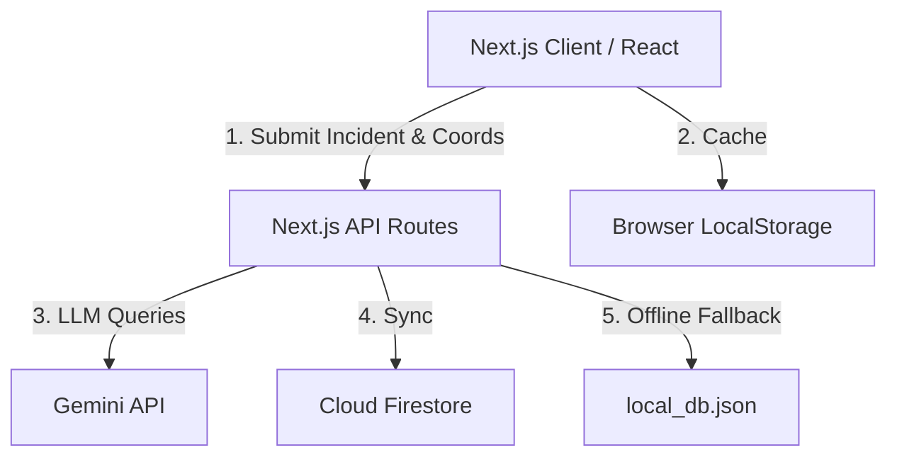
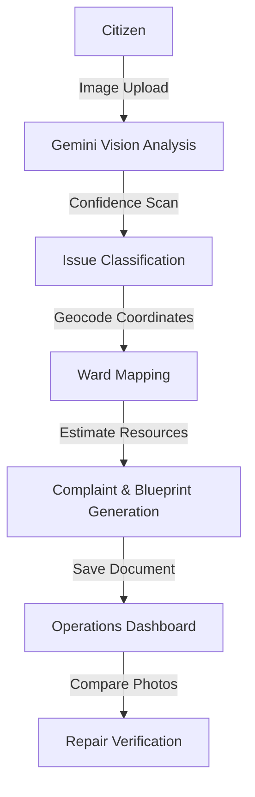

# CivicEye AI 👁️🤖

CivicEye AI is a municipal infrastructure auditing and operations dispatch platform designed for Bengaluru, India. By combining edge-oriented civic tools with multi-agent reasoning, the system automates the lifecycle of urban issues—from photo uploads and visual diagnosis to ward allocation, PDF resolution blueprint generation, and comparative repair verification.

[](https://nextjs.org/)
[](https://react.dev/)
[](https://tailwindcss.com/)
[](https://threejs.org/)
[](LICENSE)

🔗 **[Live Demo](https://civiceye-ai.vercel.app)** • 📂 **[GitHub Repository](https://github.com/tkapilkishore-oss/Civiceye-AI)**

---

## 🚀 Overview

* **The Problem**: Traditional civic grievance portals suffer from manual routing delays, duplicate ticket overhead, ambiguous location markers, and long verification queues.
* **The Solution**: CivicEye AI automates urban issue lifecycle management. Using computer vision and geospatial mapping, it classifies reports, maps them to BBMP Wards, and generates structured resolution blueprints.
* **Why it Matters**: It bridges the gap between citizens and municipal authorities, reducing response latency and ensuring public accountability via automated visual verification.

---

## ✨ Key Features

* 📷 **AI Vision Diagnostics**: Instantly analyzes uploaded images to detect potholes, water leakages, garbage, and broken streetlights with confidence scoring.
* 📍 **BBMP Ward Mapping**: Geocodes report coordinates and routes them to official Bangalore BBMP Wards (Wards 1–7).
* 🔄 **Geospatial De-duplication**: Scans a 200m radius of submissions to flag existing issues, allowing users to "Support" rather than duplicate.
* 📝 **Intelligent Complaint Generation**: Drafts formal administrative notices addressed to responsible ward officers.
* 📊 **Interactive Operations Dashboard**: Displays city-wide infrastructure trends, active alerts, and ticket distribution on an interactive Leaflet map.
* 💬 **CivicEye AI Assistant (Powered by Gemini)**: A conversational chat interface answering municipal FAQs and assisting with step-by-step reporting.
* 📑 **PDF Resolution Blueprints**: Exports printable, professional PDF reports detailing materials, labor, and budget estimates in Indian Rupees (₹).
* 🔍 **Before/After Repair Verification**: Programmatically reviews and scores resolved repair quality (0–10) using side-by-side comparative analysis.

---

## 🏗️ System Architecture



---

## 🤖 AI Workflow



---

## 🛠️ Tech Stack

| Category | Technology |
| :--- | :--- |
| **Frontend** | React, Next.js |
| **Backend** | Serverless API Routes (Next.js) |
| **AI Engine** | Gemini API (`@google/genai` SDK) |
| **Database** | Cloud Firestore, local JSON File (`local_db.json`) |
| **Maps** | Leaflet.js, OpenStreetMap |
| **Styling** | Tailwind CSS, Vanilla CSS |
| **Animations** | Three.js (WebGL Shaders), Framer Motion |
| **Deployment** | Vercel |

---

## ☁️ Google Technologies Used

* **Gemini API**: Powers image analysis, dynamic interview questions, blueprint cost estimation, chatbot, and repair quality scoring.
* **Firebase**: Hosts the client side SDK configurations.
* **Cloud Firestore**: Stores reports, user interactions, and provides real-time dashboard state synchronization.

---

## 📂 Project Structure

```text
src/
├── app/                  # Next.js App Router routing pages
│   ├── api/              # API serverless routes (analyze-image, chat, verify-repair, reports)
│   ├── dashboard/        # Operations & Analytics Dashboard page
│   ├── orchestration/    # Multi-agent Pipeline status console
│   └── report/           # Submission flow and dynamic details (/[id]) pages
├── components/           # Shared React layout components (Footer, etc.)
├── constants/            # Configuration constants (Bangalore Wards & geocoding helper)
└── lib/                  # Firestore configurations and JSON db fallback helpers
```

---

## ⚙️ Local Setup

```bash
# Clone the repository
git clone https://github.com/tkapilkishore-oss/Civiceye-AI.git

# Install dependencies
npm install

# Run the development server
npm run dev
```

---

## 🔮 Future Improvements

* 🛡️ **Dynamic Geofence Verification**: Cross-references photo EXIF camera metadata to ensure reports match user coordinates.
* 🚦 **Department Escalation Triggers**: Auto-emails formal PDF complaint blueprints directly to regional executive engineers.
* 📈 **Asset Degradation Predictive Modeling**: Tracks repair frequency to predict and flag streets prone to repeated pothole formations.
* 🔊 **Voice reporting Support**: Enables hands-free incident submission via audio transcriptions.
* 🏙️ **Multi-City Configurations**: Adds modular support for other municipal corporations (e.g. BBMP, BBMP-Greater, municipal corporations in other cities).

---

## 👨‍💻 Developer

**T. Kapil Kishore**

🤖 AI & Machine Learning Engineer

🔗 GitHub: https://github.com/tkapilkishore-oss

---

## 📄 License

This project is licensed under the MIT License - see the [LICENSE](LICENSE) file for details.
