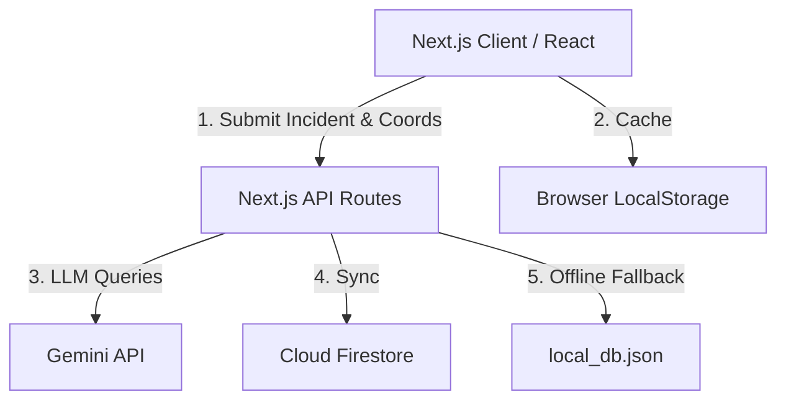
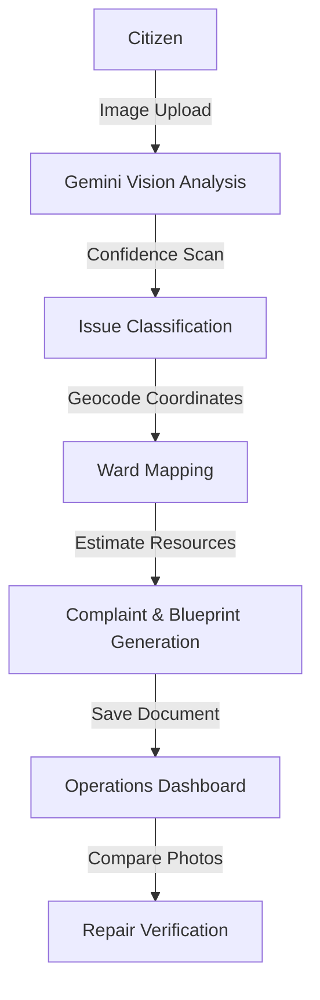

# 📑 GOOGLE AI HACKATHON — OFFICIAL SUBMISSION PROPOSAL

---

# CivicEye AI
## Autonomous AI Auditing & Operations Dispatch for Smart Cities

**Developer:** T. Kapil Kishore  
**Role:** AI & Machine Learning Engineer  
**Project Repository:** https://github.com/tkapilkishore-oss/Civiceye-AI  
**Deployment URL:** https://civiceye-ai.vercel.app  
**Submission Date:** June 26, 2026  

---

## 2. Executive Summary

Urban centers are growing at an unprecedented pace, placing heavy strain on public infrastructure. Civic corporations face massive challenges in maintaining roads, water lines, streetlights, and sanitation grids. While citizen grievance portals exist, they are bottlenecked by manual triage queues, duplicate ticket submissions, inaccurate coordinates, and a lack of post-repair validation.

**CivicEye AI** is a professional-grade, autonomous municipal operations dispatch platform built to automate the lifecycle of public infrastructure defects. By leveraging **Gemini 2.5 Flash** for computer vision and structured administrative planning, and **Google Cloud Firestore** for real-time synchronization, the platform shifts civic governance from a reactive manual process to an automated, auditable, and resilient pipeline. 

### Core Pillars of CivicEye AI:
* **Immediate AI Triage**: Converts user-uploaded photos into verified defect classes, severity ratings, and public hazard summaries.
* **Geospatial Intelligence**: Allocates geocoded coordinates to Bangalore's BBMP Wards and executes a 200m radius duplicate scan to cluster citizen feedback.
* **Administrative Automation**: Compiles technical resolution blueprints—estimating repairs in Indian Rupees (₹), workers required, and materials—alongside formal administrative complaint notices.
* **Comparative Visual Verification**: Programmatically audits contractor repairs by evaluating side-by-side "Before" and "After" photos.
* **Dual-Sync Storage**: Guarantees zero-downtime offline caching using client-side `localStorage` and a local server-side database file fallback when cloud configurations are absent.

CivicEye AI demonstrates the practical application of Generative AI in smart-city operations, providing an open, verifiable, and highly scalable standard for municipal accountability.

---

## 3. Problem Statement

Modern municipal reporting portals fail because they rely on slow, manual steps. CivicEye AI addresses several specific failure modes in municipal grievance workflows:

```
┌────────────────────────┐      ┌────────────────────────┐      ┌────────────────────────┐
│    Manual Ingestion    │ ───> │  Duplicate Congestion  │ ───> │   Delayed Dispatch     │
│ Vision classification  │      │ 200m spatial clustering│      │  Automatic BBMP Ward   │
│ is slow & inconsistent │      │ is missing; clogging DB│      │ routing is unavailable │
└────────────────────────┘      └────────────────────────┘      └────────────────────────┘
                                                                            │
┌────────────────────────┐      ┌────────────────────────┐                  │
│    Zero Verification   │ <─── │   Blind Status Updates │ <────────────────┘
│ No visual proof of     │      │ Citizens lose track of │
│ contractor work quality│      │ ticket progress / SLAs │
└────────────────────────┘      └────────────────────────┘
```

1. **Manual Ingestion & Triage Bottlenecks**: Civic departments receive thousands of complaints daily. Sorting potholes from water leaks and assigning urgency requires manual labor, leading to backlogs.
2. **Duplicate Report Congestion**: When an incident occurs in a public area, dozens of citizens submit identical complaints. Without geospatial clustering, this clogs databases and wastes field inspector hours.
3. **Inaccurate Location & Jurisdictional Routing**: Citizens often misidentify landmarks or report issues to the wrong department (e.g., routing water leaks to electrical departments). This creates inter-agency friction.
4. **Poor Citizen Visibility**: Complaints go into a "black box" where citizens receive no update on repair timelines, technical specifications, or estimated resolution budgets.
5. **No Verification Auditing**: Municipalities sign off on contractor invoices without visual proof of repair quality, leading to poor materials usage and quick road deterioration.

---

## 4. Proposed Solution

CivicEye AI provides a unified, automated lifecycle that removes friction for both citizens and municipal officers.

```
 Citizen Notices Issue ──> Citizen Uploads Image ──> AI Vision Ingestion ──> Bangalore Ward Allocation
                                                                                      │
                                                                                      ▼
Verification Audit <── Operations Dashboard <── Ticket Creation <── Resolution Blueprint & Complaint Notice
```

* **Step 1: Defect Capture**: A citizen notices an issue (e.g., a deep pothole on an arterial road) and snaps a photo on their mobile device.
* **Step 2: Ingestion & Interview**: The AI Vision Diagnostics Agent identifies the issue category and severity. The system immediately launches an interview, asking the citizen 2 follow-up questions to gather critical operational details (e.g., depth, traffic impact).
* **Step 3: Geocoding & Duplicate Scan**: The system resolves coordinates, maps them to the nearest Bangalore BBMP Ward, and scans a 200-meter radius. If a duplicate is found, the user is added as a "supporter" of the existing ticket.
* **Step 4: Blueprint Generation**: The AI compiles a structured Technical Resolution Blueprint containing:
  * Recommended municipal authority (BBMP, BWSSB, BESCOM, or SWM division).
  * Materials needed, estimated duration, and required workers.
  * Cost estimation in Indian Rupees (₹).
  * A formal administrative complaint letter addressed to the Ward Officer.
* **Step 5: Operations Dashboard & Verification**: The ticket is logged on the interactive Operations Map. Once a contractor completes the repair, they upload an "After" image. The AI Verification Agent compares it against the "Before" photo to assess quality and safety scores before marking the ticket as Resolved.

---

## 5. Key Features

| Feature | Purpose | Citizen Benefit | Municipal Benefit |
| :--- | :--- | :--- | :--- |
| **AI Vision Ingestion** | Classifies defect categories and severity scores from images. | Easy reporting without manual forms. | Eliminates manual sorting and misclassifications. |
| **Geospatial De-duplication** | Scans coordinates in a 200m radius for existing reports. | Prompts users to support tickets, saving time. | Prevents database clutter and duplicate task assignments. |
| **Intelligent Ward Mapping** | Resolves coordinates to Bangalore/BBMP Wards. | Assures reports go to local authorities. | Auto-allocates field work orders to local ward engineers. |
| **Resolution Blueprinting** | Computes technical checklists, material specs, and budgets. | Full transparency on estimated repair costs. | Simplifies procurement and job specification guidelines. |
| **AI Assistant Chat** | Answers BBMP FAQs and guides step-by-step reporting. | Provides immediate answers to municipal questions. | Reduces support staff workload for basic inquiries. |
| **Repair Verification** | Compares Before/After images for quality metrics. | Visible proof that issues are fixed correctly. | Prevents payment on incomplete or low-quality work. |
| **PDF Document Export** | Generates downloadable reports and complaint notices. | Downloadable documents for community tracking. | Official paper trails for municipal files. |

---

## 6. System Architecture

CivicEye AI is a modular Next.js application designed to run on a serverless infrastructure.



### Architectural Breakdown:
* **Frontend Layer**: Built using React and Next.js App Router for dynamic rendering, Framer Motion for animations, and Leaflet.js with OpenStreetMap tiles for responsive mapping.
* **WebGL Graphic Engine**: Features a custom Three.js WebGL shader on the landing page, providing interactive background constellations that respond to user mouse movements.
* **Serverless API Routes**: Manages vision parsing, chat agents, blueprint generation, and verification operations via serverless API routes.
* **Dual-Sync Database Architecture**: Connects to Cloud Firestore for production database synchronizations. If Firestore credentials are not present, it fails over to a local server-side JSON file (`local_db.json`) and client-side `localStorage`.
* **Deployment**: Hosted on Vercel for high global availability and fast edge response times.

---

## 7. AI Workflow

CivicEye AI coordinates a multi-agent workflow to process and verify reports.



1. **Image Upload**: Citizen uploads a photo of the defect.
2. **Gemini Vision Analysis**: Evaluates visual inputs to identify defect type and severity.
3. **Confidence Scan**: If classification confidence is below 60%, the report is marked as "Other" to prevent misrouting.
4. **Ward Mapping**: Geocodes address parameters to resolve the correct Bangalore BBMP Ward (Wards 1–7).
5. **Complaint & Blueprint Generation**: Estimates materials, labor, duration, costs (in ₹), and drafts a formal complaint.
6. **Operations Dashboard**: Incidents are plotted on the Leaflet map and synced with Cloud Firestore.
7. **Repair Verification**: Programmatically audits repair quality using Before/After image comparison.

---

## 8. Google Technologies Used

CivicEye AI relies on Google Cloud and Google AI platforms for database, security, and reasoning capabilities:

> [!IMPORTANT]
> **Gemini API (`gemini-2.5-flash`)**  
> We selected Gemini 2.5 Flash due to its high speed, low API latency, and multimodal capabilities. It handles vision diagnostics, conversational assistant chat, technical estimation blueprints, and comparative repair checks. The application includes a resilience layer with exponential backoffs to handle potential 503 API throttles.

> [!IMPORTANT]
> **Google Cloud Firestore**  
> Acts as the primary database for real-time document synchronization. The serverless API endpoints write records, and the client dashboard listens to active streams, updating the dashboard map instantly without manual refreshes.

> [!IMPORTANT]
> **Firebase Client SDK**  
> Enables quick connection management and secure environment handshakes, allowing client-side listeners to retrieve real-time data streams from Cloud Firestore.

---

## 9. Technical Implementation

The implementation focuses on speed, accessibility, and offline resilience:

### Next.js Serverless API Integration
All heavy AI pipelines and database write-backs are isolated in Next.js Serverless API routes:
* `/api/analyze-image`: Receives base64 image data, queries Gemini Vision, and yields structured JSON diagnostics.
* `/api/generate-report`: Combines geocoded data, vision attributes, and interview logs to construct technical blueprints and database entries.
* `/api/verify-repair`: Receives before/after imagery, returning comparative compliance logs.

### Bangalore Ward Routing & Configuration
The mapping system is calibrated to Bangalore’s geofences. Wards are mapped using coordinate ranges and keyword matching:
* *Ward 1 (Hebbal & Vidyaranyapura)*, *Ward 2 (Koramangala & HSR)*, *Ward 3 (Indiranagar & Domlur)*, *Ward 4 (Jayanagar & JP Nagar)*, *Ward 5 (Peenya Industrial)*, *Ward 6 (Malleshwaram)*, and *Ward 7 (Mahadevapura & Marathahalli)*.

### Offline & Local-Storage Resilience
To handle areas with poor connectivity, CivicEye AI uses a dual-sync design:
* On the client side, if Firebase client connections fail, tickets are cached in browser `localStorage`.
* On the server side, if Firebase Admin private keys are missing, the APIs fail over to a local server-side JSON file (`local_db.json`), ensuring the application remains testable out-of-the-box.

---

## 10. Innovation & Differentiators

CivicEye AI stands out by offering a closed-loop workflow that replaces manual triage with automated validation:

* **Closed-Loop Lifecycle**: Handles the entire process from visual reporting, duplicate detection, and resource allocation to automated repair verification.
* **Contextual Interviews**: Rather than using generic forms, the CivicEye AI Assistant generates follow-up questions tailored to the defect type to ensure complete reports.
* **Auditable Verification**: Prevents premature ticket closures by comparing Before/After images programmatically to generate an objective quality score.
* **Dual-Sync Database Fallback**: Combines local caching and Firestore to keep the platform functional in areas with weak cellular coverage.
* **Realistic Resource Estimations**: Uses local metrics (Indian Rupees, local materials, standard crew numbers) to align blueprints with real BBMP processes.

---

## 11. Challenges Faced

During development, several engineering challenges were addressed:

### Challenge 1: Gemini API Rate Throttling (HTTP 503)
* *The Problem*: Rapid file uploads and chat queries occasionally triggered 503 Rate Limit errors from Gemini.
* *The Solution*: Implemented a retry wrapper (`fetchWithRetry`) with exponential backoff (2s, 5s, 10s delays). If the API fails after retries, the app uses a rule-based mock engine to ensure uninterrupted user flows.

### Challenge 2: Client-side `QuotaExceededError` in Local Storage
* *The Problem*: Large base64 image strings filled the 5MB browser `localStorage` quota during offline tests.
* *The Solution*: Modified the cache helper to store only text metadata (coordinates, category, description) in `localStorage` while referencing placeholder thumbnails, keeping storage usage minimal.

### Challenge 3: Real-time Map Bounding Box Alignments
* *The Problem*: Inaccurate coordinates placed map markers outside municipal borders.
* *The Solution*: Configured strict boundaries in `dashboard/page.tsx` (`12.85° N` to `13.10° N` and `77.50° E` to `77.75° E`). Submissions outside these coordinates default to Bangalore's center.

---

## 12. Future Scope

* 🗺️ **Dynamic Geofence Verification**: Implement server-side check systems validating that image metadata (EXIF GPS) matches the submitted coordinates.
* 📨 **Automated Department Email Dispatch**: Connect the PDF generator to direct municipal emails, forwarding blueprints to ward engineers automatically.
* 📈 **Municipal Trend Analysis**: Track seasonal variations to predict recurring issues, such as pothole spikes during monsoon seasons.
* 🔊 **Voice reporting Support**: Integrate audio translation APIs to allow citizens to file reports via voice notes.
* 🏙️ **Multi-City Configuration Engine**: Modularize the ward configuration helper to support other municipal corporations like BBMP-Greater or other municipal corporations in other cities.

---

## 13. Conclusion

CivicEye AI demonstrates how Generative AI can be practically applied to smart-city governance. By using large language models for vision triage, interactive interviews, resource estimation, and quality verification, the platform automates complex administrative tasks. Built on a resilient, dual-sync architecture, it provides a stable, transparent, and scalable solution that can easily adapt to other municipal frameworks worldwide.
